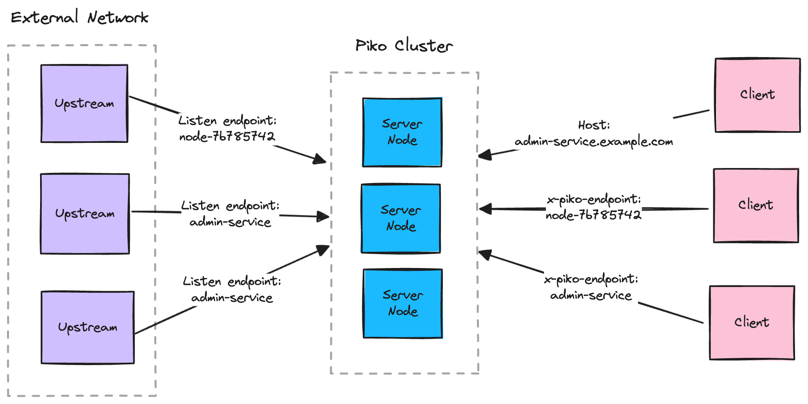

# Pico [](https://github.com/andydunstall/pico/actions/workflows/build.yaml)

> :warning: Pico is currently only a proof of concept so is not yet suitable
for production.

Pico is a reverse proxy that allows you to expose an endpoint that isn’t
publicly routable (known as tunnelling).

Unlike many open-source tunnelling solutions, Pico is designed to serve
production traffic. Such as you may use Pico to expose services in a customer
network, a bring your own cloud (BYOC) service or to connect to IoT devices.

Upstream endpoints register with Pico via an outbound-only connection. Clients
then send HTTP(S) requests to Pico which will proxy the requests to a
registered endpoint.

Requests identify the target endpoint ID using either the `Host` header or an
`x-pico-endpoint` header. When multiple endpoints have the same ID, Pico will
load balance requests for that ID among the registered endpoints. Therefore an
endpoint ID is the equivalent of a domain name in Pico.



## Contents

- [Design Goals](#design-goals)
- [Components](#components)
- [Getting Started](#getting-started)
- [Docs](#docs)
- [Limitations](#limitations)

## Design Goals

### Production Traffic
Unlike many open-source tunnelling solutions that are built for testing and
development (such as sharing a demo running on your local machine), Pico is
built to serve production traffic. Such as you could use Pico to:
* Access customer networks
* Build a bring your own cloud (BYOC) solution
* Access IoT devices

Therefore Pico supports running as a cluster of server nodes in order to be
fault tolerant, scale horizontally and support zero downtime deployments. It
also includes observability tools for monitoring, alerting and debugging.

### Hosting
Pico is designed to be simple to host, particularly on Kubernetes. A cluster of
server nodes can be hosted behind a HTTP load balancer or
[Kubernetes Gateway](https://kubernetes.io/docs/concepts/services-networking/gateway/)
as a Kubernetes deployment or stateful set.

Upstream endpoints and proxied requests may be load balanced to any node in the
cluster, then Pico will manage routing the request to the correct endpoint.

### Dynamic Endpoints
Upstreams may register any endpoint ID dynamically at runtime without any
static configuration. If there are multiple registered endpoints for a given
ID, Pico load balances requests among those endpoints.

## Components

### Server
The Pico server is responsible for proxying requests from downstream clients to
registered upstream endpoints.

Upstream endpoints register with Pico via an outbound-only connection. Clients
then send HTTP(S) requests to the Pico server, which will proxy the requests to
a registered endpoint.

Incoming requests identify the target endpoint ID using either the `Host`
header or `x-pico-endpoint` header. When the `Host` header is used, the lowest
level domain is used as the endpoint ID. Such as if you send a request to
`my-endpoint.pico.example.com`, `my-endpoint` will be used. `x-pico-endpoint`
takes precedence over the `Host`.

Pico supports running as a cluster of server nodes. Upstream listeners and
downstream clients may connect to any node in the cluster and Pico manages
routing requests to the correct listener.

The server exposes 4 ports:
* Proxy port: Listens for HTTP(S) requests from downstream clients and forwards
the requests to upstream listeners (defaults to `8000`)
* Upstream port: Listens for connections from upstream listeners (defaults to
`8001`)
* Admin port: Listens for admin requests to inspect the status of the server
(defaults to `8002`)
* Gossip port: Listens for gossip traffic between nodes in the same cluster
(defaults to `8003`)

The server has separate proxy and upstream ports as upstream listeners and
downstream clients will be in separate networks (otherwise there isn’t any need
for Pico). Such as you may expose the upstream port to the Internet for
external networks to register endpoints, though only allow requests to the
proxy port from nodes in the same network.

Run a server node with `pico server`.

### Agent
The Pico agent is a lightweight proxy that runs alongside your upstream
services that registers endpoints with the Pico server and forwards incoming
requests.

Such as you run an Pico agent and register endpoint `my-endpoint` that forwards
requests to `localhost:3000`.

Run the Pico agent with `pico agent`.

## Getting Started

This section describes how to run both the Pico server and agent locally to
register and endpoint. In production you'd host the server remotely as a
cluster, though this is still useful to demo Pico.

This example registers an endpoint `my-endpoint` and forwards requests to
`localhost:3000`. To see the requests being forwarded, start a simple file
server at `localhost:3000` with `python3 -m http.server 3000`.

Pico has a single binary that can be built with `make pico`, which is output to
`build/pico` (requires Go 1.21 or later).

### Setup

Start the Pico server with `pico server`. This listens for proxy requests on
port `8000` and upstream connections on `8001`.

Next start the Pico agent and register the above endpoint with
`pico agent –endpoints my-endpoint/localhost:3000`. This creates an outbound
connection to the Pico server that registers to receive requests for the given
endpoints.

You can inspect the status of the server using the `pico status` CLI. Such as
use `pico status proxy endpoints` to view the list of endpoints registered on
the server.

### Request

As described above, when sending a request to Pico you can identify the
endpoint ID using either the `Host` header or the `x-pico-agent`.

Therefore to send a request to the upstream endpoint use:
```
# x-pico-endpoint
curl http://localhost:8000 -H "x-pico-endpoint: my-endpoint"

# Host
curl --connect-to my-endpoint.example.com:8000:localhost:8000 http://my-endpoint.example.com:8000
```

## Docs

See [docs](./docs) for details on deploying and managing Pico:
- [Configure](./docs/deploy/configure.md)
- [Kubernetes](./docs/deploy/kubernetes.md)
- [Observability](./docs/deploy/observability.md)

## Limitations

Pico is currently only a proof of concept so is not yet suitable for
production. It likely contains bugs and is missing important features like
authentication.
