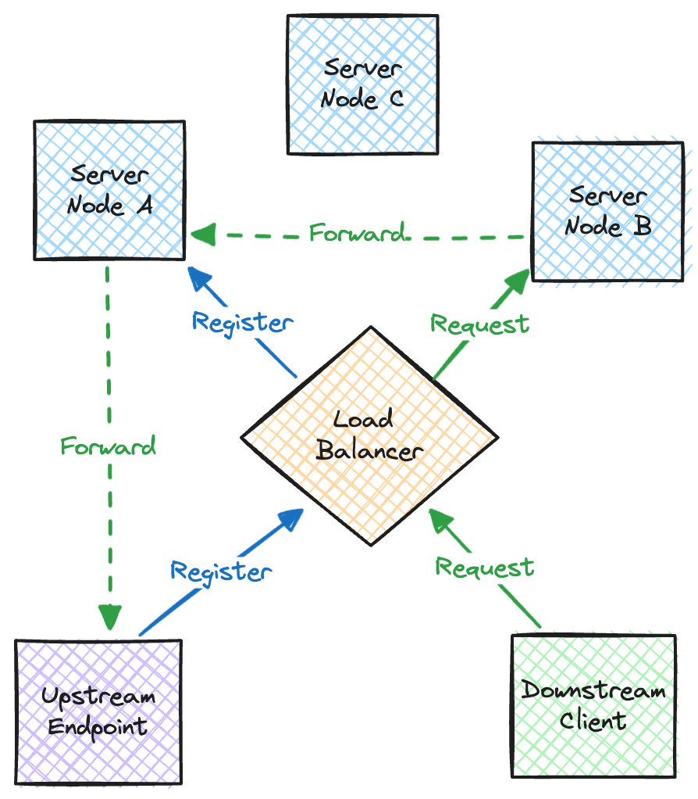

# Architecture

This document describes Pico’s architecture at a high level.

## Endpoints

In Pico, an 'endpoint' is an upstream service that connects to a Pico server
and registers itself with an endpoint ID. When a request is sent to Pico, the
server will identify the endpoint ID the request should be routed to and then
forwards the request to a connected endpoint with that ID.

Endpoints connect to a server via an outbound-only WebSocket connection. This
connection is a ‘tunnel’ from the endpoint to the server, which the server uses
to forward incoming requests to that endpoint. Therefore the endpoint doesn’t
need to expose a public port, as all incoming requests are sent via its
outbound-only connection.

Currently the only way to register an endpoint is using the Pico agent, which
is a lightweight proxy that registers the configured endpoints then forwards
incoming requests to your service. Such as you may register an endpoint
‘my-endpoint’ that forwards requests to ‘localhost:3000’. Planning to add
support for SDKs that register endpoints directly in the future.

## Server

The Pico server is responsible for accepting incoming proxy requests, then routing the requests to an appropriate endpoint connection.

Incoming requests identify the target endpoint ID using either the ‘Host’ header or ‘x-pico-endpoint’ header.

Pico is designed to be deployed as a cluster of server nodes, where both upstream endpoint connections and downstream client requests may be routed to a random node in the cluster via a load balancer. Therefore Pico must manage forwarding a request to node A to an endpoint connected to node B.

  

## Gossip

Server nodes use gossip to discover one another and learn what endpoints are
active on which the other nodes in the cluster.

When an endpoint connects to node A, it will notify the other nodes that it has
a connection for that endpoint ID. Similarly when the endpoint disconnects,
node A notifies the other nodes.

Therefore each node has an eventually consistent view of what endpoints are
active on the other nodes in the cluster.

Pico uses the [kite](https://github.com/andydunstall/kite) library for gossip.
Kite implements the Scuttlebutt protocol, which is an efficient gossip-based
anti-entropy mechanism. It also manages failure detection and cluster
membership, so if a node joins, leaves or fails, the other nodes are notified.

## Routing

When a node receives a request, it first checks if an upstream endpoint with
the requested ID is connected to the local node. If so, it forwards the request
to a connection for that endpoint. When there are multiple endpoint connections
the request is load balanced among the available connections.

If there are no upstream connections for that endpoint ID, the node looks up
whether any other nodes in the cluster have a connection for that endpoint then
forwards the request to one of those nodes.
